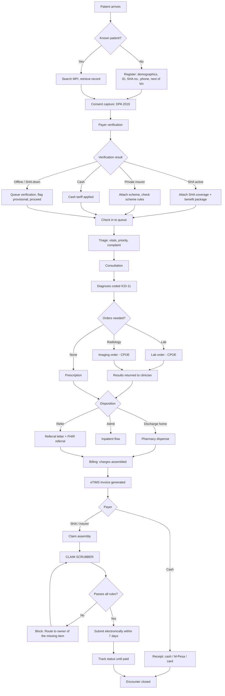
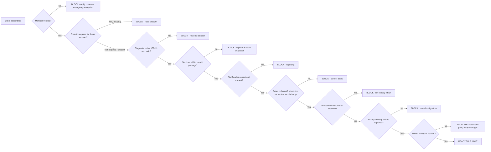
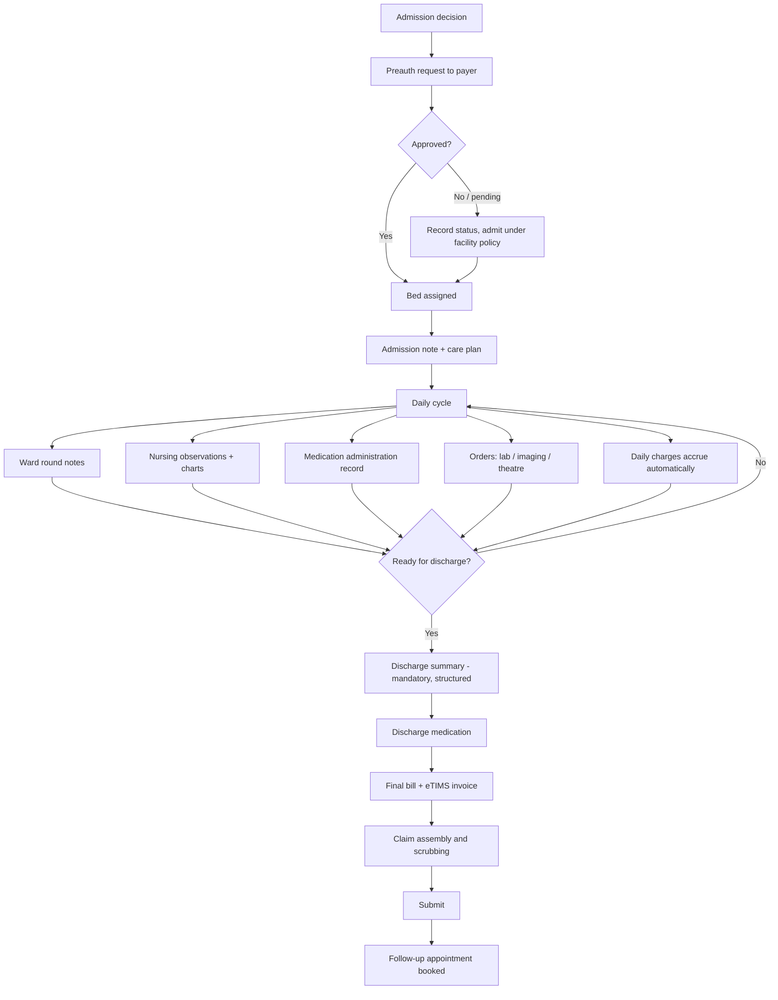
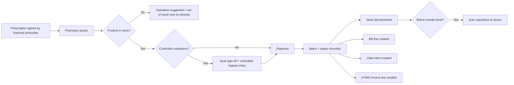
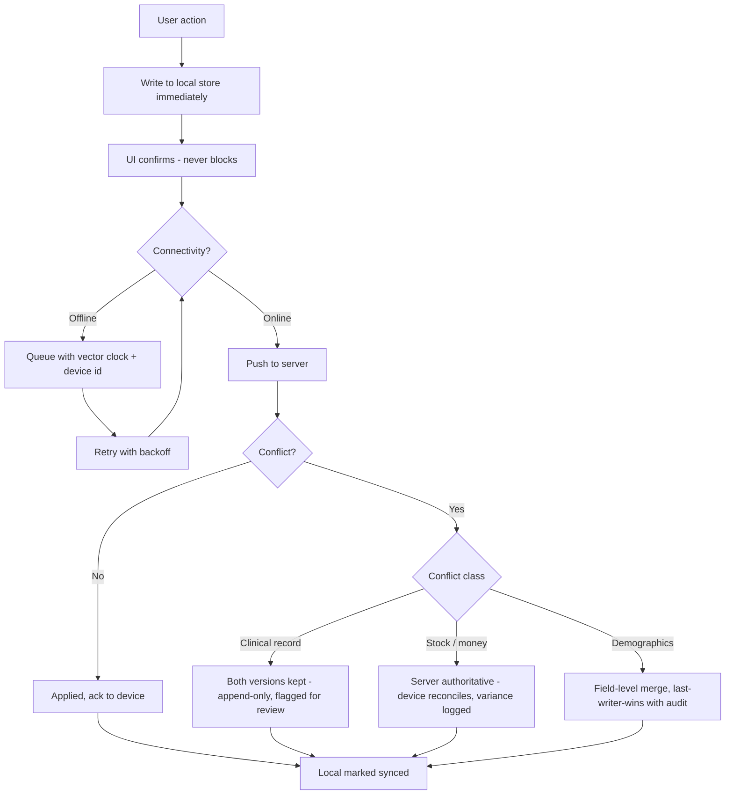
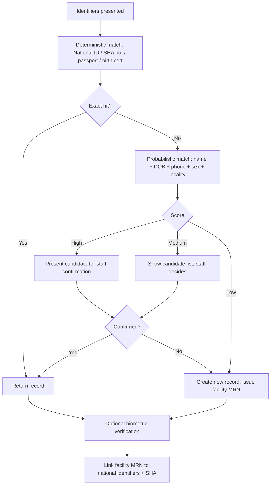

# Product Specification — Features, Functionality & Process Flows

**Working name:** *Afya Core* (placeholder)
**One line:** The HMIS that gets you paid — certified, offline-proof, and it catches a claim error before you submit.

---

## 1. Design principles

These are constraints, not aspirations. Each one answers a documented weakness from the market research.

| # | Principle | Enforced as |
|---|---|---|
| P1 | **Offline-first, not offline-tolerant** | Every clinical and billing action writes locally and syncs; the UI never blocks on the network |
| P2 | **The claim is validated before it is created** | Claim rules run at the point of care, not in the billing office at day 6 |
| P3 | **90 seconds, 15 clicks** | Budget for a standard outpatient consultation; measured in CI, treated as a failing test when breached |
| P4 | **One transactional spine** | A dispense is a stock movement is a bill line is a claim item is an eTIMS line — one event, one record |
| P5 | **FHIR-native** | Internal model mirrors FHIR resources; the HIE adapter is thin |
| P6 | **Append-only clinical record** | Nothing clinical is ever overwritten or hard-deleted; amendments are versions |
| P7 | **No shared logins, ever** | Named users, MFA for privileged roles, every action attributed |
| P8 | **Compliance is visible** | A dashboard, a changelog, and a one-button audit export |
| P9 | **Configuration over code** | Tariffs, forms, benefit rules and report definitions are data, not deployments |
| P10 | **The rollout is part of the product** | 10-day implementation playbook, super-users, go-live week, SLAs |

---

## 2. Role model

| Role | Primary surface | Key permissions |
|---|---|---|
| Receptionist / Records clerk | Registration, queue | Register, verify, book, check in |
| Triage nurse | Triage | Vitals, priority, queue routing |
| Clinician (MO / COs / consultant) | Consultation | Diagnose, prescribe, order, admit, discharge |
| Nurse (ward) | Ward | Observations, medication administration, notes |
| Pharmacist / Pharm tech | Pharmacy | Dispense, stock, controlled register |
| Lab technologist | Laboratory | Specimen, result entry, validation |
| Radiographer | Radiology | Worklist, report |
| Cashier | Billing | Receipt, payment, invoice |
| Claims officer | Claims | Preauth, claim build, submit, follow-up |
| Store keeper | Inventory | Requisition, GRN, issue |
| HR / Payroll | HR | Roster, leave, payroll |
| Accountant | Finance | GL, AR/AP, reconciliation |
| Facility administrator | Admin | Users, tariffs, config |
| Medical records officer | Reporting | MOH returns, KHIS |
| Data protection officer | Compliance | Consent, audit, breach log |
| Patient | Portal | Own records, appointments, bills |

---

## 3. The core process flows

### 3.1 Master flow — outpatient, the 80% case

### 3.2 The claim scrubber — the commercial heart of the product

Every rule below maps to a documented SHA rejection cause. A claim **cannot be submitted** while any blocking rule fails, and the system routes the fix to the person who can make it.

**Escalation timers:** day 3 — reminder to claims officer. Day 5 — reminder plus supervisor. Day 6 — facility administrator alerted, claim appears on the dashboard's red list. Day 7 — blocked from normal submission, escalation path only.

### 3.3 Inpatient flow

### 3.4 Pharmacy & stock — one event, four consequences

### 3.5 Offline & sync

**Offline scope by function:**

| Function | Offline behaviour |
|---|---|
| Registration, triage, consultation, prescribing, nursing notes | Full offline |
| Dispensing, stock movements | Full offline, server reconciles on sync |
| Billing, receipts | Full offline; provisional receipt number reconciled on sync |
| eTIMS invoice | Queued, transmitted on recovery |
| Payer verification | Cached result used; otherwise provisional with flag |
| Preauth, claim submission | Queued; submitted on recovery with the 7-day clock visible |
| Reporting, analytics | Online only |

### 3.6 Patient identity — the MPI

Duplicate merges are an explicit, permissioned, fully audited and **reversible** workflow — never an automatic background job.

---

## 4. Feature catalogue

### 4.1 Patient & front office
- Registration with National ID / SHA / passport / birth certificate / alien ID
- Master Patient Index: deterministic + probabilistic matching, merge/unmerge with audit
- Biometric enrolment and verification (fingerprint)
- Consent capture: versioned, granular, withdrawable, DPA-compliant
- Next of kin, employer, scheme and dependants
- Appointment scheduling, reminders by SMS
- Queue management with triage priority, per-department tokens, display screens
- Visit history timeline in one view

### 4.2 Clinical
- Outpatient consultation: complaint, history, examination, assessment, plan
- Structured templates per specialty, configurable without code
- ICD-11 diagnosis coding with type-ahead and favourites
- Problem list, allergies, alerts — carried forward between visits
- CPOE for lab, imaging, procedures
- E-prescribing with dose calculators, interaction and allergy checks *(tuned to avoid alert fatigue — only actionable alerts interrupt)*
- Inpatient: admission, bed and ward management, transfers
- Ward rounds, nursing observations, vitals charting, fluid balance
- Medication administration record (MAR)
- Structured discharge summary — mandatory before discharge completes
- Referral in/out, with FHIR referral bundle
- Theatre: booking, pre-op checklist, operation notes, post-op
- Maternity: ANC, labour and delivery, postnatal, Linda Mama
- Child health: immunisation schedule, growth monitoring, defaulter tracing
- Programme registers: HIV, TB, NCD, malaria
- Emergency/casualty flow with the SHA emergency pathway

### 4.3 Diagnostics
- Laboratory: order, specimen collection and tracking, worksheets, result entry, validation and release, reference ranges, panic-value alerting, analyser interfacing
- Radiology: modality worklist, DICOM study links, structured reporting, report turnaround tracking
- Results auto-returned to the ordering clinician's inbox with acknowledgement tracking

### 4.4 Pharmacy & supply chain
- PPB-registered product catalogue
- Dispensing with batch, expiry, substitution
- Controlled substances register with dual sign-off
- Multi-store inventory: main store, pharmacy, wards, theatre
- Requisition → issue → receipt chain with GRN
- Reorder levels, auto-requisition, expiry and recall sweeps
- Supplier management, purchase orders, goods received, invoice matching
- Stock take with variance reporting

### 4.5 Revenue cycle
- Configurable tariffs per payer, per scheme, per service
- Charge capture at point of service — automatic, not re-keyed
- Cash, M-Pesa, card, cheque, credit
- eTIMS-compliant invoicing and credit notes
- Deposits, part payments, statements, debtor ageing
- Payer verification and coverage determination
- Pre-authorisation request and tracking
- **Claim assembly, scrubbing, batching, submission**
- Claim status tracking, rejection reason capture and analysis, resubmission workflow
- Remittance reconciliation and payment posting
- Revenue leakage report: services delivered but not billed

### 4.6 Back office
- HR: staff records, cadres, licence numbers with expiry tracking, duty roster, leave, attendance
- Payroll with statutory deductions (PAYE, NSSF, SHIF, housing levy)
- Accounting: chart of accounts, general ledger, AR/AP, bank reconciliation, fixed assets
- Procurement and supplier payments
- Asset and equipment maintenance schedules

### 4.7 Reporting, analytics & compliance
- MOH returns generated from transactions (705A/705B, 717 and programme forms)
- KHIS/DHIS2 automated submission with reconciliation
- Notifiable disease reporting
- Management dashboards: revenue, occupancy, turnaround times, stock position
- **Claims dashboard: acceptance rate, rejection reasons ranked, value at risk, days-to-payment**
- **Compliance dashboard: certification, connections, ODPC, licence expiries, 7-day claim window**
- Audit trail — every read and write of clinical data, immutable
- One-button audit pack export

### 4.8 Patient engagement
- Patient portal: own records, results, appointments, bills
- SMS: appointment reminders, result-ready, follow-up, immunisation defaulters
- Telemedicine: scheduled video consultation with the encounter recorded normally
- Feedback and complaints capture

### 4.9 Platform
- Multi-facility / multi-branch with consolidated reporting
- Role-based access control, named users, MFA, session policy
- Offline-first sync engine
- Integration hub: FHIR/HIE/ISL, SHA, eTIMS, M-Pesa, SMS, DHIS2, analysers, DICOM
- Configuration studio: forms, tariffs, templates, report definitions as data
- Backup, restore and disaster recovery, tested and evidenced

---

## 5. Non-functional requirements

| Area | Target |
|---|---|
| Consultation speed | Standard OPD consultation ≤ 90 seconds, ≤ 15 clicks |
| Page interaction | p95 < 300 ms on a mid-range Android tablet |
| Offline endurance | 72 hours of full clinical operation without connectivity |
| Availability | 99.5% monthly for cloud services; local operation unaffected by cloud outage |
| Data residency | Production personal data stays in Kenya |
| Backup | Continuous local snapshot; encrypted off-site daily; restore tested quarterly |
| Security | MFA for privileged roles, encryption at rest and in transit, annual penetration test |
| Audit | Immutable, exportable, covering reads and writes of clinical data |
| Accessibility | WCAG 2.1 AA; usable at 100% zoom on a 10-inch tablet |
| Localisation | English and Kiswahili UI |
| Concurrency | 200 concurrent users per facility instance |

---

## 6. What we will deliberately NOT build (v1)

Scope discipline is how this ships. Explicitly out of scope for version 1:

- Full PACS image storage — we link to DICOM, we do not store studies
- Genomics, oncology protocol management, ICU ventilator integration
- A full ERP general ledger for multi-entity groups — basic accounting only
- Insurance underwriting or scheme administration
- Custom mobile apps per facility — one responsive PWA
- AI diagnosis or clinical decision autonomy — decision *support* only, always advisory
