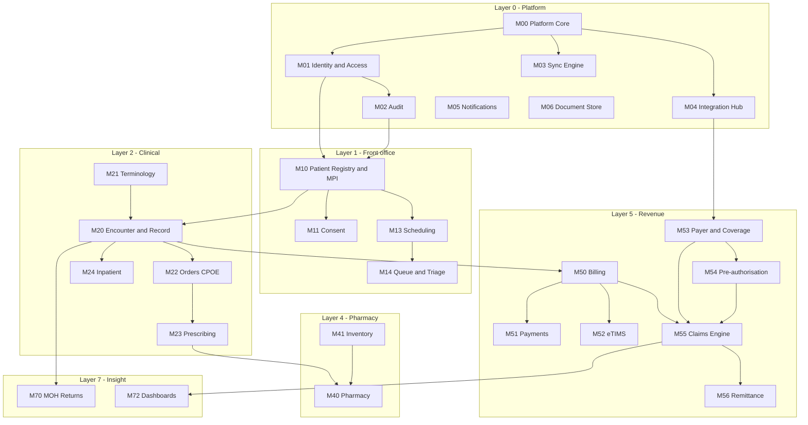

# Module Register & Step-by-Step Build Roadmap

**Purpose:** the definitive list of modules, what each one owns, what it depends on, and the order we build them.

---

## 1. Module register

Each module is a bounded context: it owns its data, exposes an API, and is independently deployable and sellable.

### Layer 0 — Platform (foundation, no clinical value alone)

| ID | Module | Owns | Depends on |
|---|---|---|---|
| **M00** | Platform Core | Tenancy, facility registry (KMHFL code), config store, feature flags, job queue | — |
| **M01** | Identity & Access | Users, roles, permissions, MFA, sessions, practitioner licence numbers + expiry | M00 |
| **M02** | Audit & Compliance Log | Immutable audit of every read/write of clinical data, export, retention | M00, M01 |
| **M03** | Sync Engine | Offline-first local store, queue, conflict resolution, device registry | M00 |
| **M04** | Integration Hub | FHIR server, HIE/ISL adapter, outbound connectors, retry, dead-letter queue | M00, M02 |
| **M05** | Notification Service | SMS, email, in-app; templates; delivery tracking | M00 |
| **M06** | Document Store | Attachments, scans, signatures, DICOM links; encryption; virus scan | M00, M02 |

### Layer 1 — Patient & front office

| ID | Module | Owns | Depends on |
|---|---|---|---|
| **M10** | Patient Registry & MPI | Patient demographics, identifiers, matching, merge/unmerge | M00, M01, M02 |
| **M11** | Consent & Data Rights | Consent versions, withdrawal, subject-access export, correction workflow | M10, M02 |
| **M12** | Biometric Verification | Fingerprint enrolment/verification, device drivers | M10 |
| **M13** | Scheduling & Appointments | Slots, bookings, reminders, no-show tracking | M10, M05 |
| **M14** | Queue & Triage | Check-in, tokens, triage priority, vitals, department routing | M10, M13 |

### Layer 2 — Clinical

| ID | Module | Owns | Depends on |
|---|---|---|---|
| **M20** | Encounter & Clinical Record | Encounters, notes, problem list, allergies, append-only versioning | M10, M01, M02 |
| **M21** | Terminology & Coding | ICD-11, procedure codes, product codes, LOINC, favourites, mapping | M00 |
| **M22** | Orders (CPOE) | Lab/imaging/procedure orders, status, results routing, acknowledgement | M20, M21 |
| **M23** | Prescribing | Prescriptions, dose calculators, interaction/allergy checks | M20, M21, M01 |
| **M24** | Inpatient & Ward | Admission, beds, wards, transfers, rounds, observations, MAR, discharge summary | M20, M22, M23 |
| **M25** | Theatre & Surgery | Booking, pre-op checklist, operation notes, post-op, theatre stock | M20, M24 |
| **M26** | Maternity & Child Health | ANC, labour & delivery, postnatal, maternity cover under SHA, immunisation, growth monitoring | M20, M10 |
| **M27** | Programme Registers | HIV, TB, NCD, malaria registers and their reporting data elements | M20, M21 |
| **M28** | Emergency & Casualty | Emergency triage, unidentified-patient handling, SHA emergency pathway | M20, M14, M41 |
| **M29** | Referrals | Inbound/outbound referrals, FHIR referral bundles | M20, M04 |

### Layer 3 — Diagnostics

| ID | Module | Owns | Depends on |
|---|---|---|---|
| **M30** | Laboratory (LIS) | Specimens, worksheets, results, validation/release, reference ranges, panic values | M22, M21 |
| **M31** | Analyser Interface | ASTM/HL7 analyser connectivity, bidirectional worklist | M30, M04 |
| **M32** | Radiology (RIS) | Modality worklist, structured reports, turnaround tracking, DICOM links | M22, M06 |

### Layer 4 — Pharmacy & supply chain

| ID | Module | Owns | Depends on |
|---|---|---|---|
| **M40** | Pharmacy & Dispensing | Dispensing, substitution, batch/expiry, controlled-drug register | M23, M41, M50 |
| **M41** | Inventory & Stores | Multi-store stock, requisition/issue/receipt, reorder, stock take, recall | M00, M21 |
| **M42** | Procurement | Suppliers, purchase orders, GRN, invoice matching | M41, M61 |

### Layer 5 — Revenue cycle *(the commercial core)*

| ID | Module | Owns | Depends on |
|---|---|---|---|
| **M50** | Charge Capture & Billing | Tariffs, charge assembly, invoices, statements, debtor ageing | M20, M21, M10 |
| **M51** | Payments | Cash, M-Pesa, card, cheque, deposits, receipts, refunds | M50 |
| **M52** | eTIMS Tax Invoicing | KRA invoice/credit-note generation, transmission queue, reconciliation | M50, M04 |
| **M53** | Payer & Coverage | Payer registry, scheme rules, benefit packages, member verification | M10, M04 |
| **M54** | Pre-authorisation | Preauth requests, tracking, attachment to claims, exception paths | M53, M20 |
| **M55** | **Claims Engine** | Claim assembly, **scrubber**, batching, submission, status, resubmission | M50, M53, M54, M21, M06 |
| **M56** | Remittance & Reconciliation | Payment advice import, posting, variance, rejection analytics | M55, M51 |

### Layer 6 — Back office

| ID | Module | Owns | Depends on |
|---|---|---|---|
| **M60** | Human Resources | Staff, cadres, licences, roster, leave, attendance | M01 |
| **M61** | Accounting & Finance | Chart of accounts, GL, AR/AP, bank reconciliation, fixed assets | M50, M51 |
| **M62** | Payroll | Salaries, PAYE, NSSF, SHIF, housing levy, payslips | M60, M61 |
| **M63** | Assets & Maintenance | Equipment register, service schedules, downtime | M00 |
| **M64** | Mortuary | Body register, storage, release, certificates | M10, M50 |

### Layer 7 — Insight & engagement

| ID | Module | Owns | Depends on |
|---|---|---|---|
| **M70** | Reporting & MOH Returns | MOH 705A/705B/717, programme reports, notifiable disease | M20, M27, M30 |
| **M71** | DHIS2 / KHIS Submission | Automated push, reconciliation, error handling | M70, M04 |
| **M72** | Analytics & Dashboards | Management, clinical, claims and compliance dashboards | all |
| **M73** | Patient Portal | Patient-facing records, results, appointments, bills | M10, M11, M20, M50 |
| **M74** | Telemedicine | Scheduled video consultation tied to a normal encounter | M13, M20 |
| **M75** | Configuration Studio | Form builder, tariff editor, template editor, report designer | M00, M01 |

**Total: 48 modules.** Version 1 commercial release needs 23 of them (Phases 0–2 below).

---

## 2. Dependency map

---

## 3. The step-by-step roadmap

Sequencing rule: **build the shortest path to a facility that can legally operate and get paid, then add depth.** Nothing in Phase 1 is optional; everything after it is a commercial decision.

---

### Phase 0 — Foundations & certification track (Weeks 1–4)

Runs in parallel with everything. The corporate work here has lead time and will otherwise become the critical path.

| Workstream | Deliverable |
|---|---|
| Regulatory | DHA vendor registration submitted; certification requirements obtained in writing; ODPC processor registration started |
| Technical | SHA HMIS and eTIMS integration specifications obtained; sandbox access requested |
| Legal | DPIA v1, data processing agreement, patient consent wording, service agreement + SLA |
| Discovery | 5 facility walkthroughs (2 clinics, 2 health centres, 1 Level 4). Time-and-motion on the current OPD flow. Collect 50 real rejected claims and classify every rejection reason |
| Engineering | Repository, CI/CD, environments, FHIR resource model, architecture decision records |
| **Modules** | **M00, M01, M02** |

**Exit gate:** SHA + eTIMS specs in hand, DHA path documented, rejection taxonomy built from real claims, platform skeleton deployed.

---

### Phase 1 — MVP: "Claim-Safe Core" (Weeks 5–14)

The smallest system a Kenyan clinic can legally run on and get paid through. This is the product that sells against the compliance deadline.

| # | Module | Why it is in the MVP |
|---|---|---|
| 1 | M03 Sync Engine | Offline-first must be in the foundation — it cannot be retrofitted |
| 2 | M04 Integration Hub | Everything regulatory goes through it |
| 3 | M06 Document Store | Claims need attachments and signatures |
| 4 | M10 Patient Registry & MPI | No identity, no claim |
| 5 | M11 Consent & Data Rights | DPA 2019 |
| 6 | M14 Queue & Triage | The front-office workflow |
| 7 | M21 Terminology & Coding | ICD-11 — wrong codes are a top rejection cause |
| 8 | M20 Encounter & Clinical Record | The clinical evidence behind the claim |
| 9 | M23 Prescribing | Required for dispensing and for claim lines |
| 10 | M50 Charge Capture & Billing | Tariffs and charges |
| 11 | M51 Payments | Cash and M-Pesa |
| 12 | M52 eTIMS Tax Invoicing | KRA — mandatory for every encounter |
| 13 | M53 Payer & Coverage | SHA member verification |
| 14 | M54 Pre-authorisation | Missing preauth = automatic rejection |
| 15 | **M55 Claims Engine + Scrubber** | **The reason anyone buys this** |
| 16 | M05 Notifications | 7-day claim countdown alerts |
| 17 | M72 Dashboards (claims + compliance only) | The owner's proof it is working |

**Exit gate — all must be true:**
- A complete outpatient encounter runs end to end, fully offline, and syncs cleanly.
- A standard consultation completes in ≤ 90 seconds and ≤ 15 clicks, measured.
- An SHA claim is verified, scrubbed, submitted and status-tracked in the sandbox.
- An eTIMS-compliant invoice is issued for every encounter, including offline-then-queued.
- The scrubber catches 100% of the rejection taxonomy built in Phase 0, replayed against the 50 real claims.
- DHA certification submitted.

**Pilot:** 3 friendly facilities, free, 6 weeks, in exchange for daily feedback and a case study.

---

### Phase 2 — Clinical depth (Weeks 15–24)

Turns the MVP into a system a health centre and a small hospital can run on.

| Module | Value |
|---|---|
| M12 Biometric Verification | SHA biometric pathway; counties are already deploying devices |
| M13 Scheduling & Appointments | Reduces no-shows, enables SMS reminders |
| M22 Orders (CPOE) | Closes the diagnostic loop |
| M30 Laboratory (LIS) | Major revenue line; lab results are claim evidence |
| M40 Pharmacy & Dispensing | Major revenue line |
| M41 Inventory & Stores | Stops stock leakage — the owner's second-biggest pain |
| M24 Inpatient & Ward | Unlocks health centres and hospitals |
| M28 Emergency & Casualty | SHA emergency/ECCIF pathway |
| M56 Remittance & Reconciliation | Closes the money loop; powers the acceptance-rate metric |
| M70 Reporting & MOH Returns | Ends the double data entry staff hate |

**Exit gate:** a Level 3 facility runs its entire operation on the system for one full month with no parallel paper process.

---

### Phase 3 — Hospital-grade (Weeks 25–36)

| Module | Unlocks |
|---|---|
| M25 Theatre & Surgery | Surgical facilities |
| M26 Maternity & Child Health | Maternity homes, SHA maternity package |
| M27 Programme Registers | Mission and public facilities, donor programmes |
| M29 Referrals | Facility networks |
| M31 Analyser Interface | Mid-size labs |
| M32 Radiology (RIS) | Imaging revenue |
| M71 DHIS2 / KHIS Submission | Public and mission facilities |
| M75 Configuration Studio | Cuts implementation time per facility — margin |

**Exit gate:** a Level 4 hospital live; per-facility implementation reduced to 10 days.

---

### Phase 4 — Back office (Weeks 37–48)

| Module |
|---|
| M60 Human Resources |
| M61 Accounting & Finance |
| M62 Payroll |
| M42 Procurement |
| M63 Assets & Maintenance |
| M64 Mortuary |

**Exit gate:** a facility can retire its separate accounting and payroll software. Raises ARPU without a new sale.

---

### Phase 5 — Engagement & intelligence (Weeks 49–60)

| Module |
|---|
| M73 Patient Portal |
| M74 Telemedicine |
| M72 Analytics (full clinical + operational) |
| Decision support: rejection prediction from our own claims history |

---

## 4. Immediate next 10 working days

| Day | Action | Output |
|---|---|---|
| 1 | Start DHA vendor registration; request SHA HMIS + eTIMS integration specs | Reference numbers, contact names |
| 2 | Start ODPC data-processor registration | Application submitted |
| 3–4 | Book and run 3 facility discovery visits | Time-and-motion notes, current-state flows |
| 5 | Collect 50 real rejected claims from pilot-candidate facilities | Raw rejection dataset |
| 6 | Build the rejection taxonomy → the scrubber rule set v1 | Rule catalogue, each rule traced to a real rejection |
| 7 | Technology decision + architecture decision records | ADRs committed |
| 8 | FHIR resource model for MVP scope | Schema + migrations |
| 9 | Repo, CI/CD, environments, M00–M02 skeleton | Deployed skeleton |
| 10 | Sign 3 pilot facilities (free pilot, 6 weeks, case study in exchange) | Signed pilot agreements |

---

## 5. Commercial model

| Tier | Facility | Modules | Price/month |
|---|---|---|---|
| **Clinic** | Level 2, ≤ 5 users | Phase 1 MVP | KES 8,000 |
| **Health Centre** | Level 3, ≤ 20 users | + Phase 2 | KES 28,000 |
| **Hospital** | Level 4, ≤ 60 users | + Phase 3 | KES 55,000 |
| **Network** | Multi-branch | + Phase 4, consolidated reporting | From KES 90,000 |

- **Implementation fee:** KES 25,000 – 150,000 by tier (data migration, training, go-live week).
- **No lifetime licence.** Regulation changes quarterly; a lifetime licence with no update obligation is how facilities end up non-compliant. Say this in the sales conversation — it is a direct attack on a competitor weakness.
- **Included in subscription:** all regulatory updates, DHA re-certification, SHA/eTIMS spec changes, support SLA.

---

## 6. Team and capacity

| Role | Phase 0–1 | Phase 2+ |
|---|---|---|
| Full-stack engineer | 2 | 3–4 |
| Clinical/domain advisor (part-time nurse or clinical officer) | 0.5 | 0.5 |
| Claims/revenue-cycle specialist (part-time) | 0.5 | 1 |
| QA | 0.5 | 1 |
| Implementation & support | 0 | 2 |

The two part-time domain roles are non-negotiable. Every documented HMIS failure traces back to software built without someone who has actually worked the counter.

---

## 7. Top risks

| Risk | Mitigation |
|---|---|
| DHA certification is slower than the build | Start day 1; design to the standard so the certificate is a formality |
| SHA spec changes mid-build | Anti-corruption layer; all payer logic behind a versioned adapter |
| Scope creep into a full ERP | The "will not build" list in the product spec is binding |
| Sync/conflict complexity is underestimated | Prototype the sync engine in week 5, before anything depends on it |
| Building without clinical reality | Two part-time domain experts, three pilot facilities, weekly on-site |
| Cannot compete with incumbents' sales reach | Compete on claim acceptance rate — a number the incumbents cannot publish |
