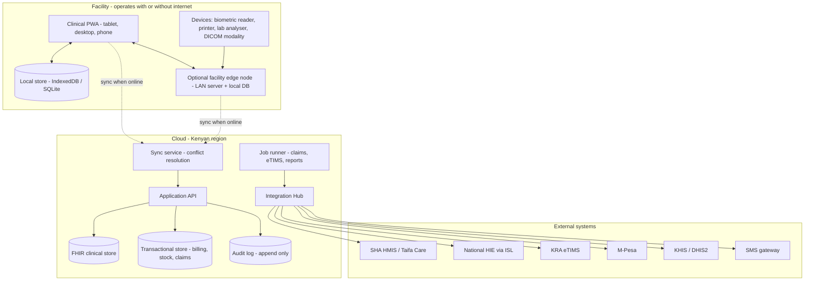

# Technical Architecture

**Status:** proposed. Confirm at the Phase 0 architecture decision record review.

---

## 1. Shape of the system

The hard constraint is **P1 — offline-first**. It dictates almost everything else, so decide it first and build nothing that contradicts it.



**Two deployment shapes, same codebase:**

| Shape | For | How |
|---|---|---|
| **Cloud + PWA** | Clinics, single-site facilities | Browser PWA with a local store; syncs direct to cloud |
| **Cloud + facility edge node** | Hospitals, poor connectivity, many concurrent users | A small LAN server holds the facility's working set; devices talk to it; it syncs upstream |

The edge node is the same application running in a different role. Do not fork the codebase for it.

---

## 2. Recommended stack

| Layer | Choice | Why |
|---|---|---|
| Frontend | **Next.js 16 (App Router) + React 19 + TypeScript**, as a PWA | Matches existing in-house expertise; service workers and background sync are first-class |
| Offline store | IndexedDB via a sync-aware layer; SQLite on the edge node | Proven in browser; SQLite gives the edge node real query power |
| Backend API | TypeScript (Node) or Go | TypeScript for team velocity and one language; Go if claim/sync throughput demands it |
| Primary database | **PostgreSQL** | Transactional integrity for money and stock; JSONB for FHIR resources; mature in Kenya |
| FHIR store | PostgreSQL-backed FHIR facade, or HAPI FHIR if certification requires a reference server | Do not buy a separate FHIR product until certification proves we need one |
| Queue / jobs | Postgres-backed queue, or Redis if volume requires | Fewer moving parts is a feature at this scale |
| Auth | Own identity service; MFA via TOTP + SMS | Practitioner licences and cadre rules are domain logic, not an off-the-shelf concern |
| Hosting | Kenyan region / local data centre | DPA 2019 data residency |
| Observability | Structured logs, metrics, error tracking, uptime | The SLA is contractual |

**Deliberate conservatism:** Postgres for everything until measurement proves otherwise. Every extra datastore is another thing to back up, secure, certify and explain to an auditor.

---

## 3. Data model spine

FHIR-native from day one (compliance C1.4). Core resources, with our extensions:

| FHIR resource | Our use | Kenyan extensions |
|---|---|---|
| `Patient` | Patient registry | National ID, SHA number, KMHFL facility MRN, biometric reference |
| `Practitioner` / `PractitionerRole` | Staff | KMPDC/NCK/KMLTTB licence number + expiry, cadre |
| `Organization` | Facility | KMHFL code, SHA provider code, KRA PIN |
| `Encounter` | Visit | Payer context, queue state |
| `Condition` | Diagnosis | ICD-11 code, claim-relevance flag |
| `Observation` | Vitals, lab results | Panic-value flag |
| `MedicationRequest` / `MedicationDispense` | Prescribe, dispense | PPB registration, batch, expiry, controlled-drug flag |
| `ServiceRequest` | Lab/imaging orders | Preauth linkage |
| `Coverage` | Payer coverage | SHA benefit package, scheme rules |
| `Claim` / `ClaimResponse` | Claims | Scrubber verdicts, submission clock, rejection reasons |
| `Consent` | Consent record | DPA 2019 version, withdrawal |
| `AuditEvent` | Audit trail | Purpose-of-use |

Money, stock and tax are **not** FHIR. They live in normalised relational tables with proper constraints. FHIR is the clinical and exchange language; it is not an accounting system.

---

## 4. The one-event-four-consequences rule (P4)

A dispense, a lab test performed, a procedure done — each is a single domain event that atomically produces:

```
ServiceDelivered(encounter, item, qty, batch, performer, timestamp)
  ├── StockMovement       → M41 Inventory
  ├── ChargeLine          → M50 Billing
  ├── ClaimItem           → M55 Claims
  └── TaxInvoiceLine      → M52 eTIMS
```

All four in one database transaction. If any consequence cannot be produced, the event does not commit. This is the structural answer to weakness **W7** (revenue leakage) — it is impossible to dispense a drug that does not appear on a bill.

---

## 5. Sync design

**Model:** local-first with an append-only operation log per device.

- Every write is an immutable operation with `(device_id, lamport_clock, actor, timestamp, payload)`.
- Devices push their operation log; the server applies in causal order and returns the authoritative log tail.
- **Conflict policy by data class:**

| Class | Policy |
|---|---|
| Clinical records | Never lose data. Both versions retained (append-only), flagged for clinician review |
| Stock & money | Server authoritative. Device reconciles; any variance is logged as a reconciliation item, never silently dropped |
| Demographics | Field-level merge, last-writer-wins per field, full audit |
| Identifiers issued offline (MRN, receipt no.) | Device-prefixed provisional IDs, reconciled to canonical IDs on sync, both retained |

**Rule:** never invent a sequence number offline that must be globally unique and gapless. Receipts and invoices get provisional device-prefixed numbers; the canonical eTIMS number is assigned on transmission and both are kept on the record.

Prototype this in week 5 of Phase 1, before any module depends on it.

---

## 6. Integration Hub

Every external system sits behind an adapter with the same contract: **queue → transform → transmit → confirm → reconcile**. No module ever calls SHA or eTIMS directly.

| Connector | Protocol | Failure behaviour |
|---|---|---|
| SHA HMIS (verification, preauth, claims) | REST/FHIR per SHA spec | Queue; use cached verification; record emergency/OTP exception path; surface the 7-day clock |
| National HIE via ISL | FHIR, purpose-of-use tagged | Queue and retry; never blocks care |
| KRA eTIMS | Per KRA spec | Queue invoices; transmit on recovery; daily reconciliation report |
| M-Pesa | Daraja API | Idempotent by transaction reference; manual reconciliation screen |
| DHIS2 / KHIS | DHIS2 Web API | Scheduled push with reconciliation report |
| SMS | Licensed aggregator | Retry with backoff; delivery receipts |
| Lab analysers | ASTM / HL7 v2 | Local to edge node; store-and-forward |
| Imaging | DICOM worklist + link | Links only; we do not store studies in v1 |

Each adapter is independently versioned. When SHA changes its specification, exactly one module changes.

---

## 7. Security posture

| Control | Implementation |
|---|---|
| Identity | Named users only; no shared accounts, enforced technically |
| MFA | Required for admin, claims, pharmacy-controlled and finance roles |
| Authorisation | Role + cadre + facility scope, evaluated server-side on every request |
| Encryption | TLS 1.3 in transit; AES-256 at rest including local device stores |
| Device control | Registered devices; remote revocation wipes the local store |
| Audit | Append-only, covering reads of clinical data as well as writes |
| Secrets | Managed secret store; nothing in the repository |
| Backups | Continuous local snapshot, encrypted off-site daily, restore drill quarterly |
| Testing | Dependency scanning in CI; annual third-party penetration test |
| Incident response | Documented plan, breach log, ODPC notification templates |

---

## 8. Quality gates in CI

Not aspirational — these fail the build:

1. **Clicks-and-seconds budget:** an automated walkthrough of the standard OPD consultation asserts ≤ 15 interactions and ≤ 90 seconds (P3).
2. **Claim scrubber regression:** the rejection corpus collected in Phase 0 is replayed; 100% must be caught.
3. **Offline conformance:** the end-to-end suite runs once with the network disabled and once with it flapping; both must pass and reconcile identically.
4. **Transaction integrity:** property test asserting that no `ServiceDelivered` event can commit without all four consequences.
5. **Audit coverage:** every clinical read/write path asserted to emit an `AuditEvent`.
6. **FHIR validity:** exported resources validate against the profiles the DHA certification requires.
